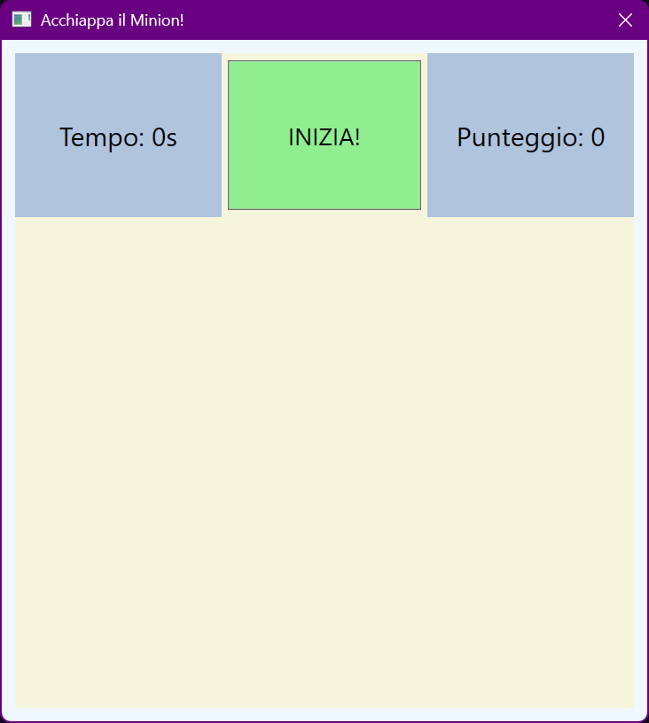
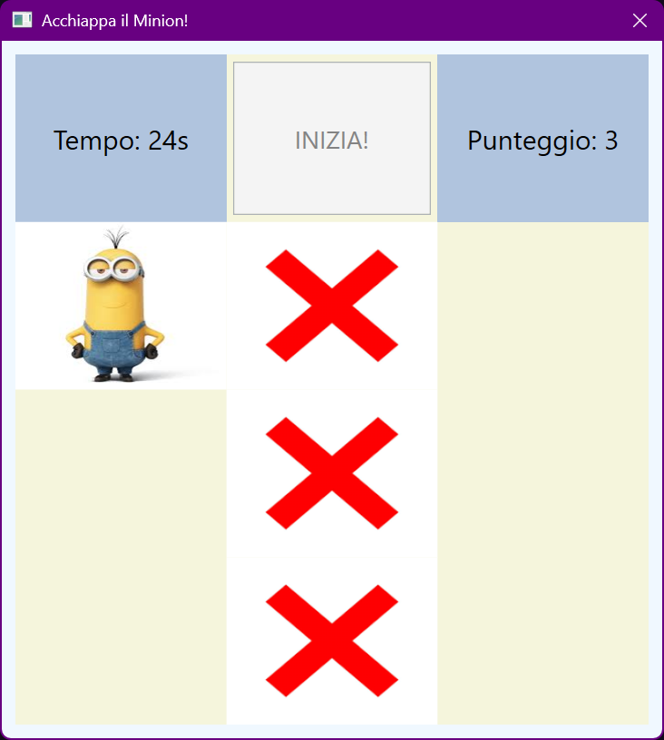

# 🟡 Minion Run – A Fun WPF Grid Game

**Minion Run** is a lighthearted, interactive desktop game built with C# and Windows Presentation Foundation (WPF). The player’s goal? Catch the elusive Minion by clicking on its image as it jumps to different spots on a 3x4 grid. With each successful hit, your score increases—reach 10 points and you win!

---

## 🎮 Game Overview

* The Minion appears randomly on the grid.
* Each correct click boosts your score by 1.
* Already-clicked cells are marked with an ❌.
* A timer keeps track of how long you're playing.
* Victory is announced once the player reaches **10 points**.

It’s a simple game, perfect for showcasing GUI interactions, logic, and real-time updates using WPF.

---

## 🔧 Tech Stack

**Development Tools & Libraries:**

* 🧑‍💻 **Language:** C#
* 🧱 **Framework:** .NET with WPF
* 📚 **Core Libraries:**

  * `System.Windows.Threading`
  * `System.Windows.Media`
  * `System.Windows.Controls`

The interface is intuitive and minimal, offering smooth interaction for users of all skill levels.

---

## 📅 Project Info

Developed by **F.D.C** during the **2024/2025** academic year at **ISIS J.M. Keynes – Gazzada Schianno (Italy)**.
This game was created as part of the school’s final exhibition project:
**“UNICA – CAPOLAVORO”** (Masterpiece Showcase).

---

## 🖼️ Screenshots

| Game Start                                     | In-Game View                                   |
| ---------------------------------------------- | ---------------------------------------------- |
|  |  |

---

## ⚠️ Disclaimer

> “Minions” and all related characters and assets are trademarks and copyrights of **Universal City Studios LLC** and **Illumination Entertainment**.
> This project is a **non-commercial, educational fan work**, and is **not affiliated with, endorsed by, or sponsored by** Universal or Illumination.

---
